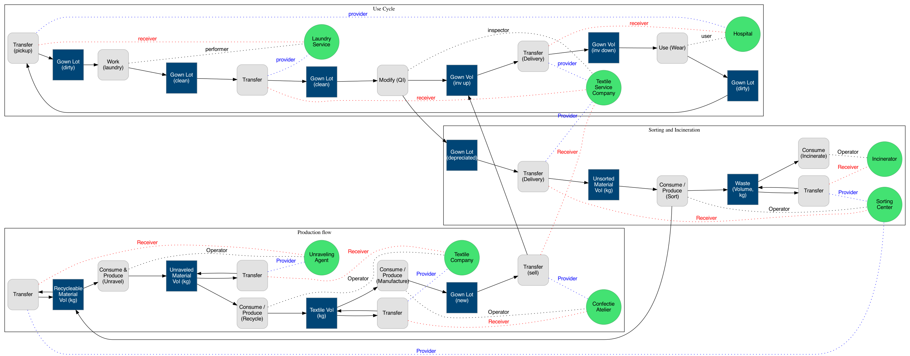

## What is this?

a ruby dsl for generating graphviz diagrams of value flows for the Amsterdam pilot in the Reflow project.

## How do i use it?

for an example see zorgschorten.rb

## How do i generate a graph?
Make sure that you have graphviz installed, and pipe the output of the script to 'dot':
For example

```$ ruby zorgschorten.rb | dot -Tpng > output.png```

Will produce the following image:


